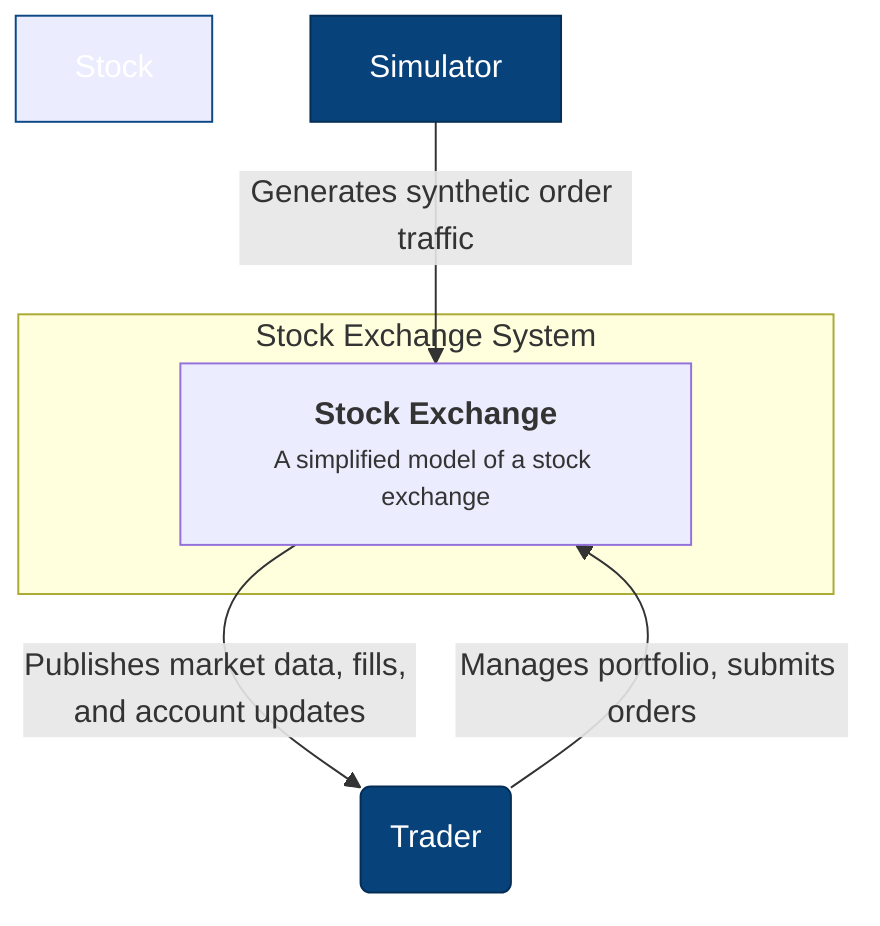
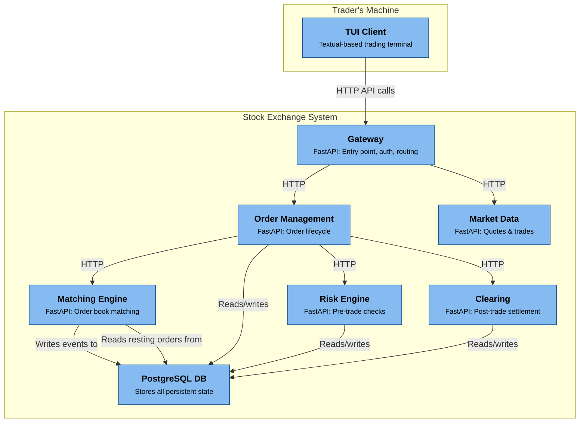
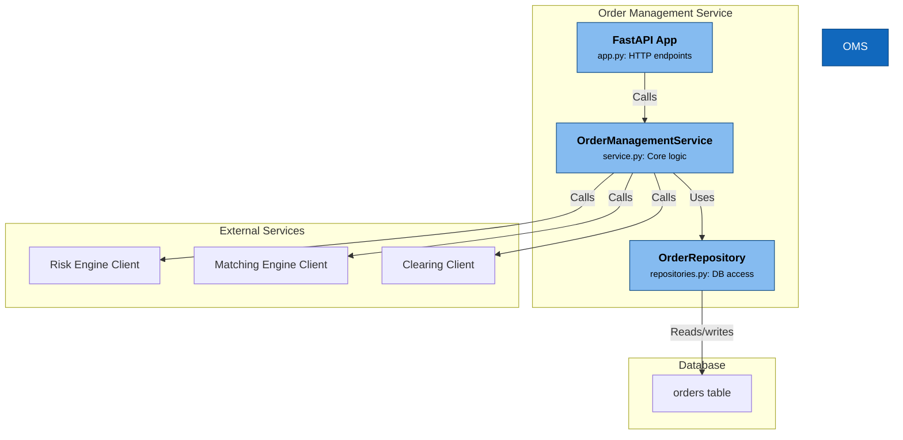
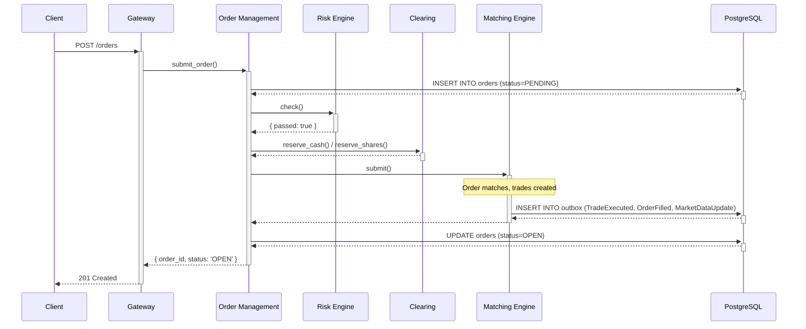
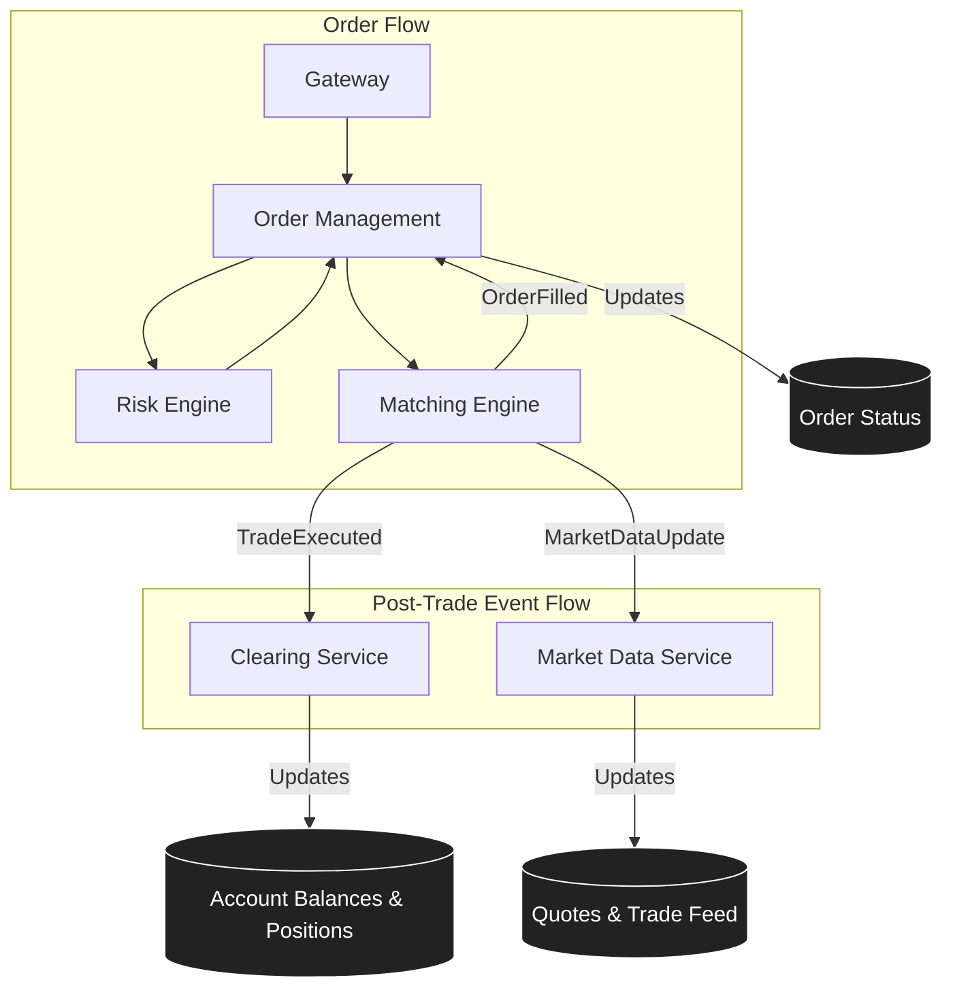

# exchange — Design of Record

This is the single design-of-record document for the exchange project: current architecture,
domain concepts, development conventions, detailed service design, limit-order-book concept
coverage, and the target architecture for the `platform/`-restructuring effort. `CLAUDE.md`
carries only the pickle marker and a pointer here.

## What this is

An educational Python monorepo implementing a simplified stock exchange.
The goal is to understand how trading works (order lifecycle, matching,
risk checks, clearing) — not to build a production-grade, high-performance system.

## Architecture overview

```text
clients/simulator      → generates synthetic order traffic for testing
clients/tui/           → interactive terminal trading app (Textual)
services/risk_engine   → pre-trade checks before orders reach the book
services/order_management → order lifecycle and persistence
services/clearing      → post-trade trade-record keeper (audit ledger only)
services/notifications → per-account event feed; WebSocket push + HTTP backfill
platform/base/         → domain models, HTTP service clients, outbox event routing, db layer
platform/gateway/      → entry point: auth, rate limiting, order routing (own installable package)
platform/market_data/  → publishes prices, depth, and trade feed (own installable package)
platform/account/      → source of truth for cash, positions, and reservations (own
                          installable package, own Alembic migration history)
platform/matching_engine/ → order book + price-time priority matching (own
                          installable package, own Alembic migration history)
infra/                 → docker-compose files and helper scripts
```

## Key domain concepts

- **Order**: instruction to buy/sell a quantity of a ticker at a price (or at market)
- **Order book**: per-ticker collection of resting limit orders, sorted by price then time
- **Match**: when a buy and sell order agree on price — produces a Trade
- **Fill**: notification to the client that their order (fully or partially) executed
- **Settlement**: post-match step (owned by Account service) that updates cash and positions
- **Reservation**: temporary hold on cash (BUY) or shares (SELL) while an order is open

## Running the project

```bash
# Install all dependencies
uv sync --extra dev

# Start Postgres + all eight microservices
just up

# Run all tests
just test

# Run the simulator to generate traffic
just sim

# Launch the interactive TUI (set account and base URL as needed)
EXCHANGE_ACCOUNT_ID=trader-0 uv run python -m clients.tui
```

## Development conventions

- The HTTP gateway (`platform/gateway/`) is a lightweight FastAPI layer that routes incoming requests to the appropriate downstream microservices.
- Each service exposes a plain Python class interface. HTTP-specific logic is confined to the `app.py` file, keeping the core service logic clean and framework-agnostic.
- Services communicate with each other via synchronous HTTP calls using `httpx`. After a match, the matching engine writes events to a PostgreSQL outbox table. A background relay process then delivers these events to downstream services.
- Three services run outbox relays: `matching_engine` (TradeExecuted/OrderFilled/MarketDataUpdate), `account` (AccountUpdated → Risk Engine), and `order_management` (OrderAccepted/Rejected/Cancelled → Notifications).
- Persistence is handled using SQLAlchemy Core (async) without an ORM. See the `platform/base/src/base/` directory for more details.
- Stateful services (require `DATABASE_URL`): `risk_engine`, `order_management`, `matching_engine`, `clearing`, `account`, `notifications`. Stateless: `gateway`, `market_data`.
- Tests are located alongside each service in its corresponding `tests/` directory.
- Domain models are defined as dataclasses in `platform/base/src/base/domain/models.py`.
- To maintain readability, each service file should ideally be kept under 200 lines. If a file grows beyond this, consider splitting it into submodules.
- All services are built with `async def`, as both FastAPI and `asyncpg` require it.
- The client-side code in `clients/tui/` is synchronous. For blocking I/O operations, use `@work(thread=True)` instead of coroutines.
- Always use `import typing as tp` instead of `from typing import XXX`. This convention ensures that types are referenced consistently (e.g., `tp.Optional`, `tp.List`).

## Account and Risk Engine freshness

- **Account** is the authoritative source for all cash/position/reservation state.
- On every mutation, Account does a best-effort synchronous HTTP push to Risk Engine (fast path) and also enqueues an `AccountUpdated` event via its outbox (resilient path).
- On boot, Risk Engine fetches all accounts from Account service (`GET /accounts`) to warm its cache.

## When modifying a service

1. Check `platform/base/` first — domain models and events are shared across all services
2. Update the service logic
3. If the change produces new events, update the relevant outbox relay's `EVENT_DESTINATIONS` and `ENDPOINT_FOR_EVENT_TYPE` maps
4. If the change affects persistent state, update the service's own `tables.py` and `repository.py`
5. Add or update tests in the service's `tests/` directory
6. Update this document's "Detailed architecture" section if the data flow changed

## Detailed architecture

> Folded in from the former `docs/architecture.md`, largely verbatim, and **not** re-audited
> against the current tree as part of this fold — treat it as historical background, not a
> current source of truth. Known gaps: it predates the `account` and `notifications` services
> becoming first-class (Clearing is shown owning balances/positions, with no Account/
> Notifications containers), and it predates the `shared/` reorganization into `shared/platform/`
> (its `shared/service_clients.py` and `shared/db/{connection,tables,repositories}.py` paths are
> stale — the real modules live under `shared/platform/clients/` and `shared/platform/db/`), and
> it further predates `shared/platform/`/`shared/domain/` moving into the `uv` workspace package
> `platform/base/` (`base.{db,http_client,request_context,clients,domain}`). See
> "Architecture overview" and "Account and Risk Engine freshness" above for the current,
> authoritative service list and ownership split; read the actual `platform/base/` tree for
> current module paths.

### C4 Model: System Context

This diagram shows the overall system landscape. The Stock Exchange is a self-contained system that interacts with traders through a command-line interface or a load-generating simulator.



### C4 Model: Container Diagram

This diagram zooms into the Stock Exchange system to show its constituent containers (services) and the primary data store.



### C4 Model: Component Diagram (Order Management Service)

This diagram shows the internal components of the `OrderManagementService`, illustrating how it separates HTTP handling from core business logic.



### Sequence Diagram: New Order Submission

This diagram details the sequence of calls made when a new order is submitted.



### Logical Data Flow

This diagram illustrates how data flows between the services, with a focus on the events published by the matching engine.



All synchronous inter-service calls are performed over HTTP using `httpx`. Trade events are delivered asynchronously via the outbox pattern, where the matching engine writes events to a PostgreSQL table. A background relay polls this table every 0.5 seconds to forward the events to downstream services.

### Service responsibilities

| Service | Port | Owns | Calls | Writes to DB |
|---|---|---|---|---|
| Gateway | 8000 | Manages the HTTP interface and translates requests/responses. | OMS, MarketData | No |
| OrderManagement | 8001 | Handles the order lifecycle and routing. | RiskEngine, MatchingEngine, Clearing | `orders` |
| RiskEngine | 8002 | Maintains an account state cache and enforces pre-trade rules. | — | `instruments` |
| MatchingEngine | 8003 | Manages order books, trade execution, and the outbox relay. | (none directly; via outbox) | `outbox` |
| Clearing | 8004 | Manages account balances and positions. | — | `accounts`, `positions`, `trades` |
| MarketData | 8005 | Provides in-memory quote snapshots and trade history. | — | No |

`platform/account/` (port 8006) and `services/notifications/` (port 8007) are implemented
but absent from the table above, which predates both — see "Architecture overview" for the
current, authoritative service list.

### HTTP gateway (`platform/gateway/`)

The gateway serves as a lightweight FastAPI layer that directs incoming requests to the appropriate downstream services via `ServiceClients`. It does not contain any business logic; instead, it is responsible for translating HTTP requests into service calls and mapping the results back to JSON responses.

```text
platform/gateway/src/gateway/
├── app.py           # FastAPI app, lifespan, router wiring
├── auth.py          # Optional X-API-Key header check
├── dependencies.py  # ServiceClients singleton (injected via Depends)
├── schemas.py       # Pydantic request/response models + converters
└── routes/
    ├── orders.py        # POST /orders, GET /orders/{id}, DELETE /orders/{id}
    ├── accounts.py      # POST /accounts, GET /accounts/{id}, GET /accounts/{id}/orders
    ├── instruments.py   # POST /instruments
    └── market_data.py   # GET /market-data/{ticker}/quote|depth|trades, /tickers
```

Authentication is opt-in: set the `EXCHANGE_API_KEY` environment variable.
When set, every request must include `X-API-Key: <value>`.
When unset, the API is open (suitable for local development).

### Inter-service communication (`shared/service_clients.py`)

Each service provides HTTP clients that mirror the Python interface of the target service. All clients share a single, pooled `httpx.AsyncClient` with a 10-second timeout.

| Client | Calls |
|---|---|
| `OrderManagementClient` | `submit_order()`, `cancel_order()`, `get_order()`, `get_orders_for_account()` |
| `RiskEngineClient` | `check()`, `register_account()`, `register_instrument()`, `halt_ticker()`, `resume_ticker()` |
| `MatchingEngineClient` | `submit()`, `cancel()`, `snapshot()`, `restore_order()` |
| `ClearingClient` | `register_account()`, `get_account()`, `reserve_cash()`, `reserve_shares()` |
| `MarketDataClient` | `all_tickers()`, `get_quote()`, `get_trade_history()` |

Service base URLs are configured via environment variables (e.g. `ORDER_MANAGEMENT_URL`).
Default values assume localhost with the standard port assignment above.

### Persistence layer (`shared/db/`)

All data persistence is managed using SQLAlchemy Core (async), without the use of an ORM. The database tables are distributed across four distinct PostgreSQL schemas.

```text
shared/db/
├── connection.py    # get_engine() singleton; reads DATABASE_URL env var
├── tables.py        # MetaData + Table definitions across 4 schemas
└── repositories.py  # OrderRepository, AccountRepository, etc.
```

**Tables:**

| Table | Schema | Populated by |
|---|---|---|
| `orders` | `order_management` | OrderManagementService (on submit, fill, cancel, reject) |
| `accounts` | `clearing` | ClearingService (on registration via POST /accounts; on each trade) |
| `positions` | `clearing` | ClearingService (on each trade) |
| `trades` | `clearing` | ClearingService (on each trade) |
| `instruments` | `risk_engine` | RiskEngine (on registration via POST /instruments) |
| `outbox` | `matching_engine` | MatchingEngine (one row per event per destination; relay marks rows published) |

**Startup DDL** uses a Postgres advisory lock (key `20260516`) to serialize `CREATE TABLE IF NOT EXISTS`
across concurrent service instances so only one runs DDL at startup.

The `DATABASE_URL` is essential for all stateful services, including `risk_engine`, `order_management`, `matching_engine`, and `clearing`. In contrast, stateless services such as `gateway` and `market_data` do not require it. The connection layer, located at `shared/db/connection.py`, provides an `AsyncEngine` using the `postgresql+asyncpg://` URL scheme and will raise an error immediately if the environment variable is not set.

For the Order Management Service (OMS) and Clearing service, the in-memory state is considered authoritative at runtime, and every mutation is immediately written through to PostgreSQL. The matching engine's order book is an exception to this rule, as resting orders are held exclusively in memory and are not persisted to a dedicated table. On startup, the engine reconstructs its order book from the `order_management.orders` table (see *Startup recovery* below).

### Startup recovery

Both stateful services that maintain in-memory caches reload their data from PostgreSQL upon startup.

**Matching engine** — The lifespan hook queries the `order_management.orders` table for all orders with a status of `OPEN` or `PARTIALLY_FILLED` and calls `restore_order()` for each one. This function re-inserts the order into the appropriate price level with its correct remaining quantity, without triggering the matching logic, ensuring that no phantom trades are generated. As a result, the order book can survive a process restart, provided the database remains intact.

**OMS** — The lifespan hook loads all orders from the `order_management.orders` table into its `_orders` in-memory cache. This ensures that fill events arriving after a restart are processed correctly, regardless of whether the orders were submitted in a previous session.

**Risk Engine** - The lifespan hook loads all accounts from `clearing.accounts` and all instruments from `risk_engine.instruments` into its in-memory caches.

Note: The matching engine reads from `order_management.orders`, and the risk engine reads from `clearing.accounts`, creating cross-schema dependencies at startup. Since all schemas reside in the same PostgreSQL instance, this is a read-only coupling rather than a service call.

### Outbox event relay (`platform/matching_engine/`)

After each match, the matching engine writes event rows to the `matching_engine.outbox` PostgreSQL table—one row for each event and destination—and immediately returns a response to the caller. A background coroutine, `_outbox_relay`, polls the table every 0.5 seconds, delivers each unpublished row via an HTTP POST request to the target service, and marks the row as published.

This outbox pattern decouples trade execution from downstream delivery and guarantees at-least-once delivery without requiring a message broker.

**Event routing:**

| Event | Destinations | Endpoint |
|---|---|---|
| `TradeExecuted` | Clearing | `/events/trade-executed` |
| `OrderFilled` | OMS | `/events/order-filled` |
| `MarketDataUpdate` | MarketData | `/events/market-data-update` |

Destination base URLs are configured via env vars (`CLEARING_URL`, `ORDER_MANAGEMENT_URL`, `MARKET_DATA_URL`).

### Infrastructure (`infra/docker/`)

```text
infra/docker/
├── compose.infra.yml     # Postgres 17 (postgres-data volume, named 'exchange' network)
└── compose.services.yml  # Eight service containers + the account-migrate one-shot
```

`compose.services.yml` declares no Postgres dependency: `postgres` lives in `compose.infra.yml`, and `depends_on` cannot reference a service outside the same compose invocation — declaring it made the file an invalid project for every one-file recipe (`build`, `up`, `down`, `logs`). The cross-stack coupling is the shared external `exchange` network instead, and the wait-for-Postgres ordering lives in the `justfile`: `just infra-up` passes `--wait`, so Postgres is healthy before any service starts, and `just up` runs `infra-up` before bringing the services up. Within `compose.services.yml`, `depends_on` does enforce inter-service ordering — `account` waits for the `account-migrate` one-shot to complete, and `risk-engine`, `order-management`, `matching-engine` and `gateway` wait on the services they call. Services that call each other still retry gracefully at the application level. Each container runs `python -m services.<name>` (or `python -m <name>` for the `platform/` packages) and is reachable on `localhost:800X`.

### Terminal client (`clients/tui/`)

An interactive trading terminal built with [Textual](https://textual.textualize.io/).

```text
clients/tui/
├── __main__.py       # Entry point: python -m clients.tui
├── app.py            # ExchangeApp — root Textual app, reactive state, workers
├── api.py            # GatewayClient — synchronous httpx wrapper
├── config.py         # AppConfig loaded from env vars
├── models.py         # Presentation dataclasses (QuoteRow, OrderRow, …)
├── tui.tcss          # Dark terminal CSS theme
├── screens/
│   ├── main_screen.py  # Three-row layout: data panels / order entry / bottom strip
│   └── help_screen.py  # F1 modal with keybinding reference
└── widgets/
    ├── market_watch.py   # Live ticker table; posts TickerSelected on row enter
    ├── order_book.py     # Bid/ask depth for selected ticker
    ├── order_entry.py    # Horizontal order ticket (full-width bar)
    ├── open_orders.py    # Active orders; d key posts CancelRequested
    ├── portfolio.py      # Cash summary + position table
    ├── trade_tape.py     # Recent trades for selected ticker
    └── order_history.py  # All orders shown in the History tab
```

The TUI polls the gateway every 2 s (market data) and 3 s (account/orders). Blocking HTTP calls run in background threads via `@work(thread=True)`; results are posted back to the UI thread via `call_from_thread`.

**Environment variables:**

| Variable | Default | Purpose |
|---|---|---|
| `EXCHANGE_BASE_URL` | `http://localhost:8000` | Gateway URL |
| `EXCHANGE_ACCOUNT_ID` | `trader-0` | Account to trade as |
| `EXCHANGE_API_KEY` | _(empty)_ | Optional `X-API-Key` header |
| `EXCHANGE_POLL_MARKET_MS` | `2000` | Market data poll interval |
| `EXCHANGE_POLL_ORDERS_MS` | `3000` | Account/orders poll interval |

### What's intentionally simplified

- **MarketData Not Persisted** — Quote snapshots, trade history, and the last traded price are stored in-memory only and will be lost upon restart. The `instruments.last_price` field reflects the price at the time of instrument registration, not the most recent trade. Intraday volume is also not retained.
- **No WebSocket for market data** — Market data must be retrieved by polling. A push-based feed can be added in the future. (`notifications` already runs a WebSocket push for per-account events — this limitation is about market data specifically.)
- **No Real Authentication** — API key authentication relies on a single shared secret. This can be upgraded to a more secure method like JWT or OAuth.
- **Instant Settlement (T+0)** — In a real-world exchange, settlement typically occurs on a T+1 or T+2 basis.
- **Outbox Relay, Not a Message Broker** — Services persist events to PostgreSQL, and a polling relay delivers them via HTTP. For lower latency and multi-consumer fan-out, this can be replaced with a dedicated message broker such as Kafka or Redis Streams.
- **At-Least-Once Delivery** — The relay retries failed deliveries on the next poll. There is no deduplication on the consumer side, so idempotent handlers are required.
- **Order Book Not Independently Persisted** — Resting orders are held exclusively in the matching engine's in-memory order book. Recovery on restart is achieved by reading from the OMS's `order_management.orders` table, meaning the engine has no self-contained persistence. If the database is wiped without restarting the services, the in-memory book will contain orders that no longer exist in the OMS, and any trades they generate will reference unknown order IDs.
- **Risk Reservation State Not Durable** — The risk engine tracks reserved cash and shares in memory to enforce pre-trade limits. If both the risk engine and OMS restart simultaneously, the engine will initialize with zero reservations for any orders that were resting before the restart. These funds will be unconstrained for new orders until the old orders are filled or cancelled.
- **No Service Discovery** — Service URLs are hardcoded as environment variables. For dynamic discovery, a tool like Consul or Kubernetes service DNS can be integrated.

## Limit order book concepts

> Folded in from the former `docs/lob_concepts_review.md`. Source article:
> [Introduction to Limit Order Books](https://www.machow.ski/posts/2021-07-18-introduction-to-limit-order-books/)
> (machow.ski, 2021). **Legend:** ✅ Implemented · ⚠️ Partial · ❌ Missing

### 1. Core Data Structures

| Concept | Status | Notes / Implementation Gap |
|---|---|---|
| **Order Book** — A two-sided list of resting limit orders. | ✅ | Implemented as the `OrderBook` class in `platform/matching_engine/src/matching_engine/order_book.py`, with one instance per ticker. |
| **Order** — Comprises a side, quantity, limit price, and submission time. | ✅ | Defined as a `dataclass` in `shared/models/domain.py`, containing all four required fields. |
| **Price Level** — A discrete price point that groups multiple orders. | ✅ | Implemented as the `PriceLevel` dataclass, which holds a `Deque[Order]` for First-In, First-Out (FIFO) ordering. |
| **Tick Size** — The minimum price increment between price levels. | ❌ | Not implemented. Orders can be submitted at any decimal price. This could be added by implementing a validator in `RiskEngine._check_price_sanity()` to round the price to the nearest tick. |

### 2. Ordering & Priority

| Concept | Status | Notes / Implementation Gap |
|---|---|---|
| **Price/Time Priority** — The best price takes precedence, with ties broken by the earliest submission time. | ✅ | Bids are sorted in descending order and asks in ascending order. A `Deque` is used to maintain the arrival order for orders at the same price level. |
| **Best Bid / Best Ask** — The highest bid and lowest ask prices at the top of the book. | ✅ | Implemented as `OrderBook.best_bid()` and `best_ask()` methods, with the values published in `MarketDataUpdate` events. |
| **Bid/Ask Spread** (`best_ask − best_bid`) | ⚠️ | The backend quote APIs do not calculate or expose the spread, but the TUI computes it from L2 depth data via `DepthSnapshot.spread` in `clients/tui/models.py`. |
| **Mid Price** (`(best_bid + best_ask) / 2`) | ❌ | This value is not calculated. It can be added with a simple one-line implementation in the `Quote` object. |

### 3. Order States

| Concept | Status | Notes / Implementation Gap |
|---|---|---|
| **Passive / Resting Order** — A limit order with a price that does not cross the book, causing it to wait for a match. | ✅ | The `_rest()` method in the matching engine inserts unmatched orders into the book. |
| **Aggressive Order** — A limit order with a price that crosses the best opposing offer, triggering an immediate match. | ✅ | The `_match()` method is called on every `add_order()` submission, allowing aggressive orders to consume resting liquidity. |
| **Unfilled** — An order that rests in the book without being executed. | ✅ | `OrderStatus.OPEN` |
| **Partially Filled** — An order where a portion of the quantity has been traded, while the remainder continues to rest in the book. | ✅ | `OrderStatus.PARTIALLY_FILLED`; the `remaining_quantity` property tracks the unfilled amount. |
| **Filled** — An order that has been fully executed and removed from the book. | ✅ | `OrderStatus.FILLED`; the `PriceLevel` removes the order from its deque once the quantity reaches zero. |

### 4. Order Lifecycle Operations

| Concept | Status | Notes / Implementation Gap |
|---|---|---|
| **New Order Submission** | ✅ | The full path is: HTTP → `OrderManagementService` → `RiskEngine` → `MatchingEngine`. |
| **Cancel Order** — Removes an order by its ID and releases any reserved funds. | ⚠️ | The path exists via `OrderManagementService.cancel_order()` → `MatchingEngine.cancel()`, and reservations are released in `OrderManagementService._release()`. However, `OrderBook._remove_resting_order()` only removes the head order at each price level, the OMS does not set `OrderStatus.CANCELLED`, and canceling does not emit a `MarketDataUpdate`. |
| **Amend Order** — Modifies the price or quantity of an existing order. | ❌ | Not supported. This would require removing the existing order from the book (losing time priority), adjusting reservations, and re-submitting. The current convention is to cancel and replace, which can be achieved using existing functionalities. |

### 5. Trade Execution

| Concept | Status | Notes / Implementation Gap |
|---|---|---|
| **Trade / Match / Fill** — The execution of a trade between two parties. | ✅ | A `Trade` dataclass is created in `_execute_fill()`, and a `TradeExecuted` event is published. |
| **Single-Level Trade** — An aggressive order that is fully filled from a single price level. | ✅ | This is a natural outcome of the matching loop. |
| **Multi-Level Trade** — An aggressive order that sweeps across multiple price levels. | ✅ | The `_match()` method iterates through price levels until the incoming order is fully filled or no more crossing prices are available. |
| **Remainder** — The unmatched portion of an order that becomes a new passive order. | ✅ | After `_match()` is called, `_rest()` is executed if `remaining_quantity > 0`. |
| **Slippage** — The difference between the expected execution price and the actual execution price. | ❌ | Not measured. For market orders, the actual fill prices are recorded in the `Trade` objects, but no slippage figure is computed or returned to the client. This would require moderate effort to calculate and include in the fill notification. |
| **Volume Weighted Average Price (VWAP)** — `Σ(price × qty) / Σqty` | ✅ | Implemented as `Order.average_fill_price`. The matching engine updates it in `_execute_fill()`, and the OMS recomputes/persists it in `OrderManagementService.on_order_filled()`. |
| **Impact Prices** — The projected best bid and ask prices after removing a certain number of shares from the book. | ❌ | Not implemented. This would require a moderate amount of effort to add a read-only query method to `OrderBook` that can walk the book without modifying its state. |

### 6. Liquidity

| Concept | Status | Notes / Implementation Gap |
|---|---|---|
| **Add Liquidity / Making** — A passive order that rests in the book. | ✅ | This is functionally present, as any resting limit order adds liquidity, but it is not explicitly labeled or tracked as a metric. |
| **Remove Liquidity / Taking** — An aggressive order that consumes liquidity from the book. | ✅ | This is functionally correct, but no specific metric is emitted. |
| **Depth** — The distance in price levels from the top of the book. | ✅ | Implemented via `depth_snapshot()` and exposed through the matching engine and gateway depth endpoints. The default depth is 10 levels, and the public APIs allow `1..25` levels, which matches the article's typical L2 range. |
| **Thin Book / Price Impact** — A market condition where large orders can significantly move the market price. | ❌ | There is no detection or warning mechanism for when the book is thin. This would require a moderate amount of effort to add a liquidity check in the risk engine. |
| **Maker/Taker Fees** — Different fees for adding versus removing liquidity. | ❌ | No fee model is implemented. This would require a moderate amount of effort to add a `FeeEngine` service, which would involve storing fee rates per instrument/account and applying them in the `ClearingService`. |
| **Market Maker Role** — A participant that simultaneously places bid and ask orders to profit from the spread. | ❌ | No special account type or role is defined. The simulator could be extended to run a market-making strategy, but the necessary infrastructure does not yet exist. |

### 7. Order Types

| Concept | Status | Notes / Implementation Gap |
|---|---|---|
| **Limit Order** — Executes at the specified limit price or better. | ✅ | `OrderType.LIMIT`; price-constrained matching is enforced in the `_match()` method. |
| **Market Order** — Executes immediately at the best available price. | ✅ | `OrderType.MARKET`; the `price_ok()` method always returns `True`. |
| **Stop Order** — Remains dormant until a trigger price is reached, at which point it becomes a market or limit order. | ❌ | Not implemented. This would require a moderate-to-hard effort, including a separate "stop order book" and a price-monitoring loop to activate orders when the `last_price` crosses the stop level. |

### 8. Time-in-Force (TIF)

| Concept | Status | Notes / Implementation Gap |
|---|---|---|
| **Good Till Cancel (GTC)** — The order remains active until it is either filled or cancelled. | ⚠️ | This is the implicit default behavior, as orders do not expire, but it is not modeled as an explicit Time-in-Force (TIF) field. |
| **Day** — The order is automatically cancelled at the end of the trading session. | ❌ | There is no concept of a trading session or an end-of-day sweep. This would require a moderate amount of effort to implement, including adding a `time_in_force` field to the `Order` and a scheduled job to cancel DAY orders. |
| **Immediate Or Cancel (IOC)** — The unfilled portion of the order is cancelled immediately after submission. | ❌ | This would require a moderate amount of effort. After `_match()` is called, if the TIF is IOC and `remaining_quantity > 0`, the `_rest()` method would be skipped and the order would be cancelled instead. |
| **Fill Or Kill (FOK)** — The order must be executed in its entirety or not at all; if the full quantity is not available, the order is rejected. | ❌ | This would require a moderate amount of effort. It would involve simulating the match without modifying the state, checking if the order can be fully filled, and then either executing or cancelling it entirely. |
| **Post Only** — The order is cancelled if it would be aggressive (i.e., if it would execute immediately). | ❌ | This would be easy to implement. Before calling `_match()`, a check would be performed to determine if the order would immediately cross the spread; if so, it would be rejected. |

### 9. Market Data Levels

| Concept | Status | Notes / Implementation Gap |
|---|---|---|
| **Level 1 (L1)** — Shows only the best bid/ask price and quantity. | ⚠️ | The quote APIs expose best bid/ask prices and last price, but not top-of-book quantities. Best-size quantities are available only indirectly via depth snapshots. |
| **Level 2 (L2)** — Displays aggregated price levels, typically 10–25 levels deep. | ✅ | Implemented via `depth_snapshot()` and the `/market-data/{ticker}/depth` gateway endpoint. Clients can request `1..25` aggregated levels per side. |
| **Level 3 (L3)** — Provides visibility into individual orders. | ❌ | Not exposed. This could be easily added as a read-only endpoint that iterates over `PriceLevel.orders`, but it is not currently implemented. |

### 10. Special Order Features

| Concept | Status | Notes / Implementation Gap |
|---|---|---|
| **Hidden Order** — An active order that is not visible in market data. | ❌ | Not implemented. This would require a moderate amount of effort, including adding a `hidden: bool` flag to the `Order` and excluding hidden orders from `depth_snapshot()` and L2/L3 data feeds. |
| **Iceberg Order** — An order with a visible display quantity and a hidden reserve, which refills upon depletion and loses time priority. | ❌ | Not implemented. This would require a moderate amount of effort, including adding `display_qty` and `reserve_qty` to the `Order`. When the visible portion is filled, it would be refilled from the reserve and re-inserted at the tail of the queue, resetting its time priority. |

### 11. Market Structure & Sessions

| Concept | Status | Notes / Implementation Gap |
|---|---|---|
| **Continuous Trading** — Live matching that occurs during a normal trading session. | ✅ | The exchange operates in continuous-trading mode at all times. |
| **Crossed Book** — A state where the best bid is greater than or equal to the best ask, which is only valid during auctions. | ⚠️ | This is prevented during normal operation, as the matching engine fires immediately on any cross. There is no auction mode where a crossed book is temporarily allowed. |
| **Auction / Call Auction** — A pre-session period where orders are accepted but no trades are executed, used to determine an uncrossing price. | ❌ | Not implemented. This would be a hard-effort task, requiring a separate auction order book, an Indicative Equilibrium Price (IEP) and Indicative Equilibrium Volume (IEV) calculation, and a session state machine. |
| **Indicative Equilibrium Price (IEP)** | ❌ | Dependent on the implementation of an auction (see above). |
| **Indicative Equilibrium Volume (IEV)** | ❌ | Dependent on the implementation of an auction (see above). |
| **Open Price / Close Price** | ❌ | Not tracked. The `MarketDataService` only stores the `last_price`. It would be easy to add `open_price` and `close_price` fields to the `Quote` object. |

### 12. Constraint Parameters

| Concept | Status | Notes / Implementation Gap |
|---|---|---|
| **Lot Size** — The minimum quantity multiple for an order. | ✅ | `Instrument.lot_size`; this is checked in `RiskEngine._check_instrument()`. |
| **Tick Size** — The minimum price increment. | ❌ | (Repeated from §1 for completeness) No price rounding or tick-size enforcement is implemented. |

### 13. Other Trading Concepts

| Concept | Status | Notes / Implementation Gap |
|---|---|---|
| **Volume** — The total number of shares traded in a given period. | ⚠️ | `Quote.volume_today` is accumulated with each `TradeExecuted` event but is reset on restart, as it is not persisted. |
| **Basis Points** — A unit used to express the spread or a fee (1 bps = 0.01%). | ❌ | No fee or spread metrics are expressed in basis points. |
| **Price Discovery** — The mechanism by which the market price is determined. | ✅ | This emerges from the matching engine, with the `last_price` being updated on every trade. |
| **"Hit the Bid" / "Lift the Ask"** — Terminology for directional aggressive orders. | ⚠️ | The mechanics are correctly implemented, but the terminology is not explicitly surfaced (e.g., there is no `aggressor_side` field on the `Trade` object). |

### Summary

| Category | Implemented | Partial | Missing |
|---|---|---|---|
| Core data structures | 3 | 0 | 1 (tick size) |
| Ordering & priority | 2 | 1 (spread) | 1 (mid price) |
| Order states | 5 | 0 | 0 |
| Order lifecycle | 1 | 1 (cancel) | 1 (amend) |
| Trade execution | 5 | 0 | 2 (slippage, impact) |
| Liquidity | 3 | 0 | 3 (thin-book, fees, MM) |
| Order types | 2 | 0 | 1 (stop) |
| Time-in-Force | 0 | 1 (GTC implicit) | 4 (DAY, IOC, FOK, Post-Only) |
| Market data levels | 1 (L2) | 1 (L1) | 1 (L3) |
| Special order features | 0 | 0 | 2 (hidden, iceberg) |
| Market sessions | 1 | 1 (crossed book) | 4 (auction, IEP, IEV, open/close) |
| Constraints | 1 | 0 | 1 (tick size) |
| Other | 1 | 2 | 1 |
| **Total** | **25** | **7** | **22** |

#### Effort classification for remaining gaps

| Effort | Items |
|---|---|
| **Easy** (< 1 day) | Backend spread and mid-price on quote APIs, top-of-book size on L1 quote responses, open/close price on `Quote`, Post-Only TIF, L3 endpoint |
| **Moderate** (1–3 days) | Tick size, IOC/FOK TIF, Day TIF + session sweep, slippage reporting, impact price query, amend order, hidden orders, iceberg orders, thin-book risk check, fee engine, fully correct queued-order cancellation |
| **Hard** (> 3 days) | Stop/stop-limit orders, call auction + IEP/IEV, full maker/taker fee model, market maker role/rebates |

## Target architecture: `platform/` restructuring

Decided in conversation (2026-09-16), full parity with a reference monorepo
(`~/Projects/private/monolith`). Every later migration ticket (EXC-004 onward — `platform/base`
extraction, one ticket per service moving into `platform/<name>/`, `clients/` import updates,
Alembic, per-service Docker, justfile/CI restructuring, per-service versioning) is written
against the numbered decisions below and may cite one as `EXC-003 decision N`.

1. **Workspace becomes a `uv` workspace with `platform/<service>/` packages plus one shared
   `platform/base/` package.** Each service becomes its own installable package (own
   `pyproject.toml`, hatchling, `src/` layout, own version starting at `0.0.1`), depending on
   `platform/base/` for shared config, DB engine, HTTP client, request context, and any
   Repository/Unit-of-Work base classes (see EXC-001, if it lands first). Services already never
   import each other directly (HTTP-only) — cross-service Python imports do not need to be
   invented, only the current single flat install needs splitting.
2. **Each of the 6 stateful services gets its own independent Alembic migration history**,
   version table scoped to that service's own Postgres schema (schema-per-service already
   exists in code — `services/*/tables.py` already pass `schema=...`). A `<service>-migrate`
   one-shot compose container per stateful service gates that service's startup, replacing the
   current create-on-boot bootstrap (`shared/platform/db/tables.py:25`'s
   `CREATE SCHEMA IF NOT EXISTS`).
3. **Each service package gets its own two-stage Dockerfile** (`uv`-based builder, distroless
   runtime, non-root), replacing the single shared `infra/docker/Dockerfile`.
4. **Root `justfile` moves to `mod`-imported per-service recipes, each service package carrying
   its own `justfile`; CI becomes one reusable GitHub Actions workflow, called by a thin
   per-service workflow file, path-filtered** so a service's CI only runs when that service (or
   `platform/base`, or the workspace lockfile) changes.
5. **Each service versions independently**: own SemVer starting at `0.0.1`, own `CHANGELOG.md`
   (Keep a Changelog format), release tags `<service>-vX.Y.Z`, own `PACKAGING.md` (why
   `src/`-layout + implicit namespace package, if applicable) and `RELEASING.md` (the manual
   release procedure). This supersedes the existing unused single-repo `[tool.semantic_release]`
   block in the current root `pyproject.toml` — that block is removed once each service has its
   own versioning story (tracked by the future per-service versioning ticket, not this document).
6. **`CLAUDE.md` is emptied to the pickle marker plus a one-line pointer to this document**
   (literal parity with the reference project, which carries no CLAUDE.md/AGENTS.md content of
   its own at all). `AGENTS.md` is unaffected — already marker-only.
7. **`docs/architecture.md` and `docs/lob_concepts_review.md` fold into this document as
   sections** (see "Detailed architecture" and "Limit order book concepts" above), then both
   files are deleted — monolith parity is a single prose design doc, not a doc tree.
8. **The ticket that wrote this document (EXC-003) shipped documentation only** — this file, the
   `CLAUDE.md` edit, the two doc deletions, and `development/review-addendum.md`'s
   cross-reference fix. No `platform/`, Alembic, Docker, justfile, or versioning code changed as
   part of it.
