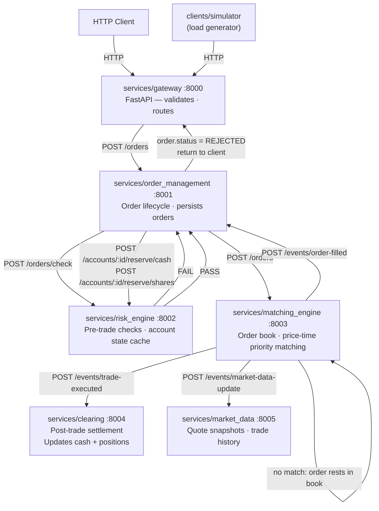

# Architecture

## Data flow for a single order



All inter-service calls are HTTP (httpx). The matching engine fans out trade events by calling downstream services directly after a match.

## Service responsibilities

| Service | Port | Owns | Calls | Writes to DB |
|---|---|---|---|---|
| Gateway | 8000 | HTTP interface, request/response translation | OMS, MarketData | no |
| OrderManagement | 8001 | Order lifecycle, routing | RiskEngine, MatchingEngine | orders |
| RiskEngine | 8002 | Account state cache, pre-trade rules | — | no |
| MatchingEngine | 8003 | Order books, trade execution, event fan-out | Clearing, OMS, MarketData | no |
| Clearing | 8004 | Account balances, positions | — | accounts, positions, trades |
| MarketData | 8005 | Quote snapshots, trade history (memory only) | — | no |

`services/account/` and `services/notifications/` are scaffolded but not yet implemented.

## HTTP gateway (`services/gateway/`)

The gateway is a thin FastAPI layer that routes requests to downstream services via `ServiceClients`.
It contains no business logic — it translates HTTP requests into service calls and maps results back to JSON.

```text
services/gateway/
├── app.py           # FastAPI app, lifespan, router wiring
├── auth.py          # Optional X-API-Key header check
├── dependencies.py  # ServiceClients singleton (injected via Depends)
├── schemas.py       # Pydantic request/response models + converters
└── routes/
    ├── orders.py        # POST /orders, GET /orders/{id}, DELETE /orders/{id}
    ├── accounts.py      # POST /accounts, GET /accounts/{id}, GET /accounts/{id}/orders
    ├── instruments.py   # POST /instruments
    └── market_data.py   # GET /market-data/{ticker}/quote|depth|trades, /tickers
```

Authentication is opt-in: set the `EXCHANGE_API_KEY` environment variable.
When set, every request must include `X-API-Key: <value>`.
When unset, the API is open (suitable for local development).

## Inter-service communication (`shared/service_clients.py`)

Each service exposes HTTP clients that mirror the Python interface of the target service.
All clients share a pooled `httpx.AsyncClient` (timeout 10s).

| Client | Calls |
|---|---|
| `OrderManagementClient` | `submit_order()`, `cancel_order()`, `get_order()`, `get_orders_for_account()` |
| `RiskEngineClient` | `check()`, `register_account()`, `register_instrument()`, `update_reserved_cash()`, `update_reserved_shares()`, `halt_ticker()`, `resume_ticker()` |
| `MatchingEngineClient` | `submit()`, `cancel()`, `snapshot()`, `restore_order()` |
| `ClearingClient` | `register_account()`, `get_account()` |
| `MarketDataClient` | `all_tickers()`, `get_quote()`, `get_trade_history()` |

Service base URLs are configured via environment variables (e.g. `ORDER_MANAGEMENT_URL`).
Default values assume localhost with the standard port assignment above.

## Exchange facade (`exchange/main.py`)

For testing and demo purposes a monolithic `Exchange` class wires all six services in-process
without HTTP. This is the entry point used by `python -m exchange.main` and unit tests.

```python
exchange = await Exchange.create(db_engine=engine)  # pass None for pure in-memory
await exchange.submit_order(order)
```

`Exchange.create()` calls `_load_state()` which:

1. Loads instruments → registers with RiskEngine, restores `last_price` to order book
2. Loads accounts → registers with RiskEngine and ClearingService
3. Loads all orders → restores to OrderManagement's in-memory dict
4. Loads OPEN / PARTIALLY_FILLED orders → re-inserts into the matching engine book (without triggering re-matching)

## Persistence layer (`shared/db/`)

All persistence uses SQLAlchemy Core (async) — no ORM. Tables are split across three Postgres schemas.

```text
shared/db/
├── connection.py    # get_engine() singleton; reads DATABASE_URL env var
├── tables.py        # MetaData + 6 Table definitions across 3 schemas
└── repositories.py  # OrderRepository, AccountRepository,
                     # InstrumentRepository, TradeRepository
```

**Tables:**

| Table | Schema | Populated by |
|---|---|---|
| `orders` | `order_management` | OrderManagementService (on submit, fill, cancel, reject) |
| `accounts` | `clearing` | Clearing (on each trade); Exchange (on register) |
| `positions` | `clearing` | ClearingService (on each trade, full replace per account) |
| `reserved_shares` | `clearing` | ClearingService (on each trade, full replace per account) |
| `instruments` | `risk_engine` | Exchange.register_instrument; Exchange (last_price on each trade) |
| `trades` | `clearing` | ClearingService (on each trade) |

**Startup DDL** uses a Postgres advisory lock (key `20260516`) to serialise `CREATE TABLE IF NOT EXISTS`
across concurrent service instances so only one runs DDL at startup.

**Persistence is opt-in.** Pass a SQLAlchemy `AsyncEngine` to `Exchange.create(db_engine=...)` to enable it.
Without an engine the exchange runs entirely in-memory — useful for tests and the demo script.
The connection layer (`shared/db/connection.py`) returns an `AsyncEngine` using the `postgresql+asyncpg://` URL scheme.

**Write-through pattern.** In-memory state is authoritative at runtime; every mutation immediately writes through to Postgres so the DB is always consistent with memory.

## Event bus (`shared/events/bus.py`)

The event bus is an in-process publish/subscribe mechanism.
In the microservices deployment the bus is used **within the matching engine only** to decouple
trade execution from HTTP fan-out. In the single-process facade (`exchange/main.py`) the bus
connects all six services directly.

`publish()` is an async coroutine; all handlers registered via `subscribe()` must be `async def` coroutines.
Events are delivered sequentially — each handler is awaited before the next runs, preserving causal ordering.
Handler exceptions are logged but do not block other handlers.

**Events:**

| Event | Published by | Handled by |
|---|---|---|
| `OrderSubmitted` | OMS | — |
| `OrderAccepted` | OMS | — |
| `OrderRejected` | OMS | — |
| `OrderCancelled` | OMS | — |
| `TradeExecuted` | MatchingEngine | Clearing, MarketData |
| `OrderFilled` | MatchingEngine | OMS |
| `MarketDataUpdate` | MatchingEngine | MarketData |

In a production system the bus would be replaced with Kafka or Redis Streams.

## Infrastructure (`infra/docker/`)

```text
infra/docker/
├── compose.infra.yml     # Postgres 18 (postgres-data volume, named 'exchange' network)
└── compose.services.yml  # Six service containers; startup order enforced via depends_on
```

Service startup order (enforced by healthchecks): `risk-engine` → `clearing` → `market-data` → `matching-engine` → `order-management` → `gateway`.

Each service container runs `python -m services.<name>` and is reachable on `localhost:800X`.

## What's intentionally simplified

- **MarketData not persisted** — quote snapshots and trade history are in-memory only; they reset on restart. The last price is recoverable via `instruments.last_price`, but intraday volume is lost.
- **No WebSocket** — market data requires polling. Add a push feed later.
- **No real authentication** — API key auth is a single shared secret. Add JWT / OAuth later.
- **Async in-process** — the event bus delivers events sequentially (each handler is awaited before the next), preserving deterministic ordering. Replace the bus with Kafka or Redis Streams to go multi-process.
- **Instant settlement (T+0)** — real exchanges settle T+1 or T+2.
- **HTTP fan-out, not a message broker** — the matching engine calls downstream services directly over HTTP rather than publishing to a topic. Add a broker (Kafka, Redis Streams) to decouple producers from consumers.
- **No service discovery** — service URLs are hardcoded env vars. Add Consul or Kubernetes service DNS for dynamic discovery.
