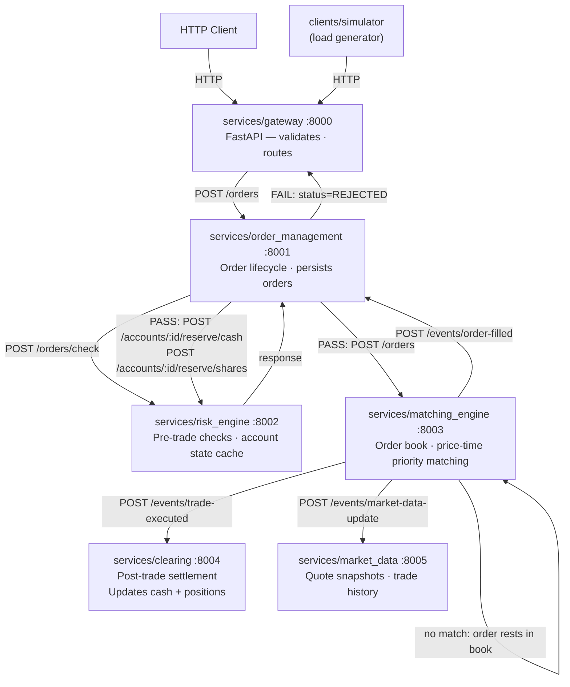

# Architecture

## Data flow for a single order



All synchronous inter-service calls are performed over HTTP using `httpx`. Trade events are delivered asynchronously via the outbox pattern, where the matching engine writes events to a PostgreSQL table. A background relay polls this table every 0.5 seconds to forward the events to downstream services.

## Service responsibilities

| Service | Port | Owns | Calls | Writes to DB |
|---|---|---|---|---|
| Gateway | 8000 | Manages the HTTP interface and translates requests/responses. | OMS, MarketData | No |
| OrderManagement | 8001 | Handles the order lifecycle and routing. | RiskEngine, MatchingEngine | `orders` |
| RiskEngine | 8002 | Maintains an account state cache and enforces pre-trade rules. | — | `instruments` |
| MatchingEngine | 8003 | Manages order books, trade execution, and the outbox relay. | Clearing, OMS, MarketData | `outbox` |
| Clearing | 8004 | Manages account balances and positions. | — | `accounts`, `positions`, `trades` |
| MarketData | 8005 | Provides in-memory quote snapshots and trade history. | — | No |

`services/account/` and `services/notifications/` are scaffolded but not yet implemented.

## HTTP gateway (`services/gateway/`)

The gateway serves as a lightweight FastAPI layer that directs incoming requests to the appropriate downstream services via `ServiceClients`. It does not contain any business logic; instead, it is responsible for translating HTTP requests into service calls and mapping the results back to JSON responses.

```text
services/gateway/
├── app.py           # FastAPI app, lifespan, router wiring
├── auth.py          # Optional X-API-Key header check
├── dependencies.py  # ServiceClients singleton (injected via Depends)
├── schemas.py       # Pydantic request/response models + converters
└── routes/
    ├── orders.py        # POST /orders, GET /orders/{id}, DELETE /orders/{id}
    ├── accounts.py      # POST /accounts, GET /accounts/{id}, GET /accounts/{id}/orders
    ├── instruments.py   # POST /instruments
    └── market_data.py   # GET /market-data/{ticker}/quote|depth|trades, /tickers
```

Authentication is opt-in: set the `EXCHANGE_API_KEY` environment variable.
When set, every request must include `X-API-Key: <value>`.
When unset, the API is open (suitable for local development).

## Inter-service communication (`shared/service_clients.py`)

Each service provides HTTP clients that mirror the Python interface of the target service. All clients share a single, pooled `httpx.AsyncClient` with a 10-second timeout.

| Client | Calls |
|---|---|
| `OrderManagementClient` | `submit_order()`, `cancel_order()`, `get_order()`, `get_orders_for_account()` |
| `RiskEngineClient` | `check()`, `register_account()`, `register_instrument()`, `update_reserved_cash()`, `update_reserved_shares()`, `halt_ticker()`, `resume_ticker()` |
| `MatchingEngineClient` | `submit()`, `cancel()`, `snapshot()`, `restore_order()` |
| `ClearingClient` | `register_account()`, `get_account()` |
| `MarketDataClient` | `all_tickers()`, `get_quote()`, `get_trade_history()` |

Service base URLs are configured via environment variables (e.g. `ORDER_MANAGEMENT_URL`).
Default values assume localhost with the standard port assignment above.

## Persistence layer (`shared/db/`)

All data persistence is managed using SQLAlchemy Core (async), without the use of an ORM. The database tables are distributed across three distinct PostgreSQL schemas.

```text
shared/db/
├── connection.py    # get_engine() singleton; reads DATABASE_URL env var
├── tables.py        # MetaData + 7 Table definitions across 3 schemas (+ outbox)
└── repositories.py  # OrderRepository, AccountRepository,
                     # InstrumentRepository, TradeRepository, OutboxRepository
```

**Tables:**

| Table | Schema | Populated by |
|---|---|---|
| `orders` | `order_management` | OrderManagementService (on submit, fill, cancel, reject) |
| `accounts` | `clearing` | ClearingService (on registration via POST /accounts; on each trade) |
| `positions` | `clearing` | ClearingService (on each trade, full replace per account) |
| `reserved_shares` | `clearing` | ClearingService (on each trade, full replace per account) |
| `instruments` | `risk_engine` | RiskEngine (on registration via POST /instruments) |
| `trades` | `clearing` | ClearingService (on each trade) |
| `outbox` | `matching_engine` | MatchingEngine (one row per event per destination; relay marks rows published) |

**Startup DDL** uses a Postgres advisory lock (key `20260516`) to serialise `CREATE TABLE IF NOT EXISTS`
across concurrent service instances so only one runs DDL at startup.

The `DATABASE_URL` is essential for all stateful services, including `risk_engine`, `order_management`, `matching_engine`, and `clearing`. In contrast, stateless services such as `gateway` and `market_data` do not require it. The connection layer, located at `shared/db/connection.py`, provides an `AsyncEngine` using the `postgresql+asyncpg://` URL scheme and will raise an error immediately if the environment variable is not set.

For the Order Management Service (OMS) and Clearing service, the in-memory state is considered authoritative at runtime, and every mutation is immediately written through to PostgreSQL. The matching engine's order book is an exception to this rule, as resting orders are held exclusively in memory and are not persisted to a dedicated table. On startup, the engine reconstructs its order book from the `order_management.orders` table (see *Startup recovery* below).

## Startup recovery

Both stateful services that maintain in-memory caches reload their data from PostgreSQL upon startup.

**Matching engine** — The lifespan hook queries the `order_management.orders` table for all orders with a status of `OPEN` or `PARTIALLY_FILLED` and calls `restore_order()` for each one. This function re-inserts the order into the appropriate price level with its correct remaining quantity, without triggering the matching logic, ensuring that no phantom trades are generated. As a result, the order book can survive a process restart, provided the database remains intact.

**OMS** — The lifespan hook loads all orders from the `order_management.orders` table into its `_orders` in-memory cache. This ensures that fill events arriving after a restart are processed correctly, regardless of whether the orders were submitted in a previous session.

Note: The matching engine reads from `order_management.orders`, creating a cross-schema dependency at startup. Since both schemas reside in the same PostgreSQL instance, this is a read-only coupling rather than a service call.

## Outbox event relay (`services/matching_engine/`)

After each match, the matching engine writes event rows to the `matching_engine.outbox` PostgreSQL table—one row for each event and destination—and immediately returns a response to the caller. A background coroutine, `_outbox_relay`, polls the table every 0.5 seconds, delivers each unpublished row via an HTTP POST request to the target service, and marks the row as published.

This outbox pattern decouples trade execution from downstream delivery and guarantees at-least-once delivery without requiring a message broker.

**Event routing:**

| Event | Destinations | Endpoint |
|---|---|---|
| `TradeExecuted` | Clearing, MarketData | `/events/trade-executed` |
| `OrderFilled` | OMS | `/events/order-filled` |
| `MarketDataUpdate` | MarketData | `/events/market-data-update` |

Destination base URLs are configured via env vars (`CLEARING_URL`, `ORDER_MANAGEMENT_URL`, `MARKET_DATA_URL`).

## Infrastructure (`infra/docker/`)

```text
infra/docker/
├── compose.infra.yml     # Postgres 17 (postgres-data volume, named 'exchange' network)
└── compose.services.yml  # Six service containers; all depend only on Postgres health
```

All six service containers share a single `depends_on: postgres: condition: service_healthy` — no inter-service dependency ordering is enforced by docker-compose. Services that call each other retry gracefully at the application level. Each container runs `python -m services.<name>` and is reachable on `localhost:800X`.

## Terminal client (`clients/tui/`)

An interactive trading terminal built with [Textual](https://textual.textualize.io/).

```text
clients/tui/
├── __main__.py       # Entry point: python -m clients.tui
├── app.py            # ExchangeApp — root Textual app, reactive state, workers
├── api.py            # GatewayClient — synchronous httpx wrapper
├── config.py         # AppConfig loaded from env vars
├── models.py         # Presentation dataclasses (QuoteRow, OrderRow, …)
├── tui.tcss          # Dark terminal CSS theme
├── screens/
│   ├── main_screen.py  # Three-row layout: data panels / order entry / bottom strip
│   └── help_screen.py  # F1 modal with keybinding reference
└── widgets/
    ├── market_watch.py   # Live ticker table; posts TickerSelected on row enter
    ├── order_book.py     # Bid/ask depth for selected ticker
    ├── order_entry.py    # Horizontal order ticket (full-width bar)
    ├── open_orders.py    # Active orders; d key posts CancelRequested
    ├── portfolio.py      # Cash summary + position table
    ├── trade_tape.py     # Recent trades for selected ticker
    └── order_history.py  # All orders shown in the History tab
```

The TUI polls the gateway every 2 s (market data) and 3 s (account/orders). Blocking HTTP calls run in background threads via `@work(thread=True)`; results are posted back to the UI thread via `call_from_thread`.

**Environment variables:**

| Variable | Default | Purpose |
|---|---|---|
| `EXCHANGE_BASE_URL` | `http://localhost:8000` | Gateway URL |
| `EXCHANGE_ACCOUNT_ID` | `trader-0` | Account to trade as |
| `EXCHANGE_API_KEY` | _(empty)_ | Optional `X-API-Key` header |
| `EXCHANGE_POLL_MARKET_MS` | `2000` | Market data poll interval |
| `EXCHANGE_POLL_ORDERS_MS` | `3000` | Account/orders poll interval |

## What's intentionally simplified

- **MarketData Not Persisted** — Quote snapshots, trade history, and the last traded price are stored in-memory only and will be lost upon restart. The `instruments.last_price` field reflects the price at the time of instrument registration, not the most recent trade. Intraday volume is also not retained.
- **No WebSocket** — Market data must be retrieved by polling. A push-based feed can be added in the future.
- **No Real Authentication** — API key authentication relies on a single shared secret. This can be upgraded to a more secure method like JWT or OAuth.
- **Instant Settlement (T+0)** — In a real-world exchange, settlement typically occurs on a T+1 or T+2 basis.
- **Outbox Relay, Not a Message Broker** — The matching engine persists events to PostgreSQL, and a polling relay delivers them via HTTP. For lower latency and multi-consumer fan-out, this can be replaced with a dedicated message broker such as Kafka or Redis Streams.
- **At-Least-Once Delivery** — The relay retries failed deliveries on the next poll. There is no deduplication on the consumer side, so idempotent handlers are required.
- **Order Book Not Independently Persisted** — Resting orders are held exclusively in the matching engine's in-memory order book. Recovery on restart is achieved by reading from the OMS's `order_management.orders` table, meaning the engine has no self-contained persistence. If the database is wiped without restarting the services, the in-memory book will contain orders that no longer exist in the OMS, and any trades they generate will reference unknown order IDs.
- **Risk Reservation State Not Durable** — The risk engine tracks reserved cash and shares in memory to enforce pre-trade limits. If both the risk engine and OMS restart simultaneously, the engine will initialize with zero reservations for any orders that were resting before the restart. These funds will be unconstrained for new orders until the old orders are filled or cancelled.
- **No Service Discovery** — Service URLs are hardcoded as environment variables. For dynamic discovery, a tool like Consul or Kubernetes service DNS can be integrated.
