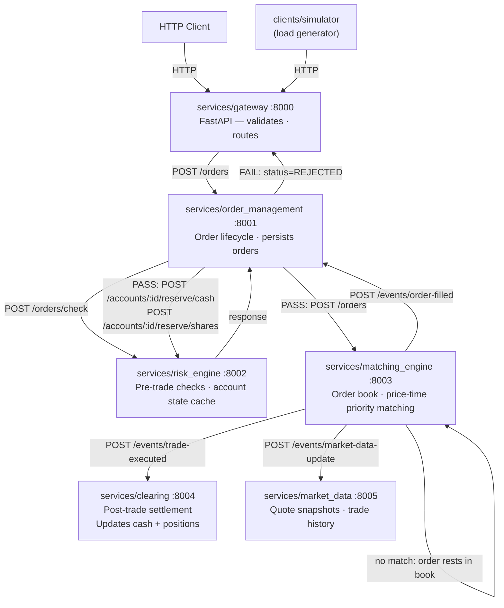

# Architecture

## Data flow for a single order



All synchronous inter-service calls are HTTP (httpx). Trade events are delivered asynchronously via the outbox pattern: the matching engine writes events to a Postgres table, and a background relay polls every 0.5 s to forward them to downstream services.

## Service responsibilities

| Service | Port | Owns | Calls | Writes to DB |
|---|---|---|---|---|
| Gateway | 8000 | HTTP interface, request/response translation | OMS, MarketData | no |
| OrderManagement | 8001 | Order lifecycle, routing | RiskEngine, MatchingEngine | orders |
| RiskEngine | 8002 | Account state cache, pre-trade rules | — | instruments |
| MatchingEngine | 8003 | Order books, trade execution, outbox relay | Clearing, OMS, MarketData | outbox |
| Clearing | 8004 | Account balances, positions | — | accounts, positions, trades |
| MarketData | 8005 | Quote snapshots, trade history (memory only) | — | no |

`services/account/` and `services/notifications/` are scaffolded but not yet implemented.

## HTTP gateway (`services/gateway/`)

The gateway is a thin FastAPI layer that routes requests to downstream services via `ServiceClients`.
It contains no business logic — it translates HTTP requests into service calls and maps results back to JSON.

```text
services/gateway/
├── app.py           # FastAPI app, lifespan, router wiring
├── auth.py          # Optional X-API-Key header check
├── dependencies.py  # ServiceClients singleton (injected via Depends)
├── schemas.py       # Pydantic request/response models + converters
└── routes/
    ├── orders.py        # POST /orders, GET /orders/{id}, DELETE /orders/{id}
    ├── accounts.py      # POST /accounts, GET /accounts/{id}, GET /accounts/{id}/orders
    ├── instruments.py   # POST /instruments
    └── market_data.py   # GET /market-data/{ticker}/quote|depth|trades, /tickers
```

Authentication is opt-in: set the `EXCHANGE_API_KEY` environment variable.
When set, every request must include `X-API-Key: <value>`.
When unset, the API is open (suitable for local development).

## Inter-service communication (`shared/service_clients.py`)

Each service exposes HTTP clients that mirror the Python interface of the target service.
All clients share a pooled `httpx.AsyncClient` (timeout 10s).

| Client | Calls |
|---|---|
| `OrderManagementClient` | `submit_order()`, `cancel_order()`, `get_order()`, `get_orders_for_account()` |
| `RiskEngineClient` | `check()`, `register_account()`, `register_instrument()`, `update_reserved_cash()`, `update_reserved_shares()`, `halt_ticker()`, `resume_ticker()` |
| `MatchingEngineClient` | `submit()`, `cancel()`, `snapshot()`, `restore_order()` |
| `ClearingClient` | `register_account()`, `get_account()` |
| `MarketDataClient` | `all_tickers()`, `get_quote()`, `get_trade_history()` |

Service base URLs are configured via environment variables (e.g. `ORDER_MANAGEMENT_URL`).
Default values assume localhost with the standard port assignment above.

## Persistence layer (`shared/db/`)

All persistence uses SQLAlchemy Core (async) — no ORM. Tables are split across three Postgres schemas.

```text
shared/db/
├── connection.py    # get_engine() singleton; reads DATABASE_URL env var
├── tables.py        # MetaData + 7 Table definitions across 3 schemas (+ outbox)
└── repositories.py  # OrderRepository, AccountRepository,
                     # InstrumentRepository, TradeRepository, OutboxRepository
```

**Tables:**

| Table | Schema | Populated by |
|---|---|---|
| `orders` | `order_management` | OrderManagementService (on submit, fill, cancel, reject) |
| `accounts` | `clearing` | ClearingService (on registration via POST /accounts; on each trade) |
| `positions` | `clearing` | ClearingService (on each trade, full replace per account) |
| `reserved_shares` | `clearing` | ClearingService (on each trade, full replace per account) |
| `instruments` | `risk_engine` | RiskEngine (on registration via POST /instruments) |
| `trades` | `clearing` | ClearingService (on each trade) |
| `outbox` | `matching_engine` | MatchingEngine (one row per event per destination; relay marks rows published) |

**Startup DDL** uses a Postgres advisory lock (key `20260516`) to serialise `CREATE TABLE IF NOT EXISTS`
across concurrent service instances so only one runs DDL at startup.

**`DATABASE_URL` is required** for all stateful services (risk_engine, order_management, matching_engine, clearing). Stateless services (gateway, market_data) do not need it. The connection layer (`shared/db/connection.py`) returns an `AsyncEngine` using the `postgresql+asyncpg://` URL scheme and raises immediately if the variable is absent.

**Write-through pattern.** For OMS and Clearing, in-memory state is authoritative at runtime and every mutation immediately writes through to Postgres. The matching engine's order book is the exception: resting orders are held purely in memory and are **not** written to a dedicated table. The engine reconstructs its book from `order_management.orders` on startup (see *Startup recovery* below).

## Startup recovery

Both stateful services that hold in-memory caches reload them from Postgres on startup.

**Matching engine** — the lifespan hook queries `order_management.orders` for every order whose status is `OPEN` or `PARTIALLY_FILLED` and calls `restore_order()` for each. `restore_order()` re-inserts the order into the appropriate price level at its correct remaining quantity without triggering the matching logic, so no phantom trades are generated. This means the order book survives a process restart as long as the database is intact.

**OMS** — the lifespan hook loads all orders from `order_management.orders` into its `_orders` in-memory cache. Fill events arriving after restart are therefore processed correctly regardless of whether the orders were submitted in a previous process lifetime.

Note: the matching engine reads from `order_management.orders` — a cross-schema dependency at startup. The two schemas share the same Postgres instance, so this is a read-only coupling rather than a service call.

## Outbox event relay (`services/matching_engine/`)

After each match the matching engine writes event rows to the `matching_engine.outbox` Postgres table — one row per event per destination — and immediately returns a response to the caller. A background coroutine (`_outbox_relay`) polls the table every 0.5 s, delivers each unpublished row via HTTP POST to the target service, and marks the row as published.

This outbox pattern decouples trade execution from downstream delivery and guarantees at-least-once delivery without a message broker.

**Event routing:**

| Event | Destinations | Endpoint |
|---|---|---|
| `TradeExecuted` | Clearing, MarketData | `/events/trade-executed` |
| `OrderFilled` | OMS | `/events/order-filled` |
| `MarketDataUpdate` | MarketData | `/events/market-data-update` |

Destination base URLs are configured via env vars (`CLEARING_URL`, `ORDER_MANAGEMENT_URL`, `MARKET_DATA_URL`).

## Infrastructure (`infra/docker/`)

```text
infra/docker/
├── compose.infra.yml     # Postgres 17 (postgres-data volume, named 'exchange' network)
└── compose.services.yml  # Six service containers; all depend only on Postgres health
```

All six service containers share a single `depends_on: postgres: condition: service_healthy` — no inter-service dependency ordering is enforced by docker-compose. Services that call each other retry gracefully at the application level. Each container runs `python -m services.<name>` and is reachable on `localhost:800X`.

## Terminal client (`clients/tui/`)

An interactive trading terminal built with [Textual](https://textual.textualize.io/).

```text
clients/tui/
├── __main__.py       # Entry point: python -m clients.tui
├── app.py            # ExchangeApp — root Textual app, reactive state, workers
├── api.py            # GatewayClient — synchronous httpx wrapper
├── config.py         # AppConfig loaded from env vars
├── models.py         # Presentation dataclasses (QuoteRow, OrderRow, …)
├── tui.tcss          # Dark terminal CSS theme
├── screens/
│   ├── main_screen.py  # Three-row layout: data panels / order entry / bottom strip
│   └── help_screen.py  # F1 modal with keybinding reference
└── widgets/
    ├── market_watch.py   # Live ticker table; posts TickerSelected on row enter
    ├── order_book.py     # Bid/ask depth for selected ticker
    ├── order_entry.py    # Horizontal order ticket (full-width bar)
    ├── open_orders.py    # Active orders; d key posts CancelRequested
    ├── portfolio.py      # Cash summary + position table
    ├── trade_tape.py     # Recent trades for selected ticker
    └── order_history.py  # All orders shown in the History tab
```

The TUI polls the gateway every 2 s (market data) and 3 s (account/orders). Blocking HTTP calls run in background threads via `@work(thread=True)`; results are posted back to the UI thread via `call_from_thread`.

**Environment variables:**

| Variable | Default | Purpose |
|---|---|---|
| `EXCHANGE_BASE_URL` | `http://localhost:8000` | Gateway URL |
| `EXCHANGE_ACCOUNT_ID` | `trader-0` | Account to trade as |
| `EXCHANGE_API_KEY` | _(empty)_ | Optional `X-API-Key` header |
| `EXCHANGE_POLL_MARKET_MS` | `2000` | Market data poll interval |
| `EXCHANGE_POLL_ORDERS_MS` | `3000` | Account/orders poll interval |

## What's intentionally simplified

- **MarketData not persisted** — quote snapshots, trade history, and the last traded price are in-memory only and reset on restart. `instruments.last_price` reflects the price at instrument registration, not the last trade. Intraday volume is also lost.
- **No WebSocket** — market data requires polling. Add a push feed later.
- **No real authentication** — API key auth is a single shared secret. Add JWT / OAuth later.
- **Instant settlement (T+0)** — real exchanges settle T+1 or T+2.
- **Outbox relay, not a message broker** — the matching engine persists events to Postgres and a polling relay delivers them via HTTP. Replace the relay with Kafka or Redis Streams for lower latency and multi-consumer fan-out.
- **At-least-once delivery** — the relay retries failed rows on the next poll. There is no deduplication on the consumer side; idempotent handlers are assumed.
- **Order book not independently persisted** — resting orders live only in the matching engine's in-memory book. Recovery on restart works by reading from OMS's `order_management.orders` table, so the engine has no self-contained persistence. If the database is wiped without restarting the services, the in-memory book will contain orders that no longer exist in OMS, and any trades they generate will reference unknown order IDs.
- **Risk reservation state not durable** — the risk engine tracks reserved cash and shares in memory to enforce pre-trade limits. If both the risk engine and OMS restart simultaneously, the engine starts with zero reservations for any orders that were resting before the restart. Those funds are effectively unconstrained against new orders until the old orders fill or are cancelled.
- **No service discovery** — service URLs are hardcoded env vars. Add Consul or Kubernetes service DNS for dynamic discovery.
